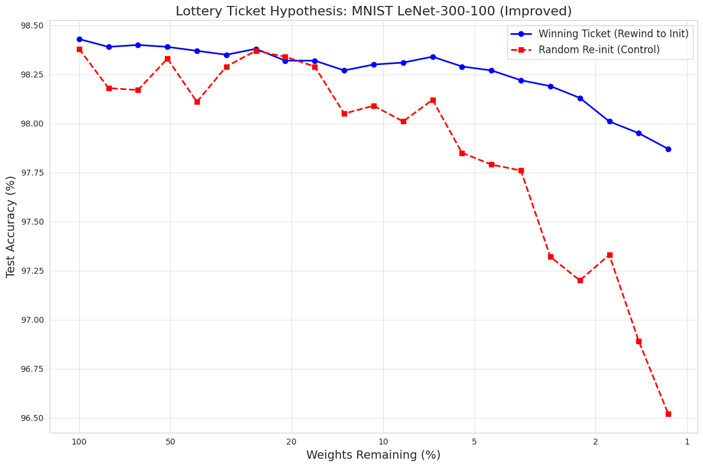

# The Lottery Ticket Hypothesis: PyTorch Implementation

##  Project Overview
This repository contains a reproduction of the **Lottery Ticket Hypothesis (LTH)** as proposed by Frankle & Carbin (ICLR 2019). The hypothesis posits that dense neural networks contain smaller, sparse subnetworks ("winning tickets") which, when trained in isolation from their original initialization state ($W_0$), can match or exceed the test accuracy of the original dense network.

This project validates this hypothesis on the **MNIST** dataset using the **LeNet-300-100** architecture, demonstrating that a network pruned to **<1.2%** of its original size can still achieve **~98% accuracy**.

---

##  Methodology

### 1. Architecture
We use the classic **LeNet-300-100** fully connected network:
- **Input**: 784 dimensions (28x28 flattened MNIST images)
- **Hidden Layer 1**: 300 neurons (ReLU)
- **Hidden Layer 2**: 100 neurons (ReLU)
- **Output**: 10 classes (Softmax)
- **Total Parameters**: ~266,000

### 2. Pruning Strategy: Iterative Magnitude Pruning (IMP)
The "winning ticket" is found via the following iterative process:
1.  **Initialize** a network with random weights $W_0$.
2.  **Train** the network for $j$ epochs to reach weights $W_j$.
3.  **Prune** the smallest $p\%$ of weights (by magnitude) globally across the network.
4.  **Reset** the remaining weights back to their original values in $W_0$.
5.  **Repeat** steps 2-4 for $n$ rounds.

### 3. Hyperparameters (`lot_improved.py`)
- **Optimizer**: SGD (Learning Rate: 0.01, Momentum: 0.9)
- **Pruning Rate**: 20% per round ($p=0.2$)
- **Pruning Method**: Global Pruning (weights compared across all layers)
- **Training**: 20 Epochs per round
- **Rounds**: 20 Iterations (Final Sparsity: ~1.15%)

---

##  Results & Analysis

Our experiments strongly validate the hypothesis. Below is a summary of the performance of the **Winning Ticket** (rewound to $W_0$) versus a **Randomly Initialized** sparse network (Control).

| Round | Weights Remaining (%) | Winning Ticket Accuracy | Random Init Accuracy | Delta |
| :---: | :---: | :---: | :---: | :---: |
| 0 | 100.00% | 98.43% | 98.38% | +0.05% |
| 10 | 10.74% | 98.30% | 98.09% | +0.21% |
| 15 | 3.52% | 98.22% | 97.76% | +0.46% |
| **20** | **1.15%** | **97.87%** | **96.52%** | **+1.35%** |

### Key Observations
1.  **Extreme Sparsity**: The network maintains **97.87% accuracy** even when **98.85% of parameters are removed**.
2.  **The "Lottery" Effect**: As sparsity increases (moving right-to-left on the graph), the gap between the Winning Ticket and the Control group widens significantly. At 1.15% sparsity, the specific initialization ($W_0$) provides a **1.35% accuracy boost** over random weights.
3.  **Architectural Discovery**: Global pruning revealed that the network aggressively prunes the input layer (fc1) while preserving the output layer (fc3), effectively "learning" the optimal architecture for the task.



---

##  Repository Structure

| File | Description |
| :--- | :--- |
| `lot.py` | **Initial Prototype**: A basic implementation using Layer-wise pruning and the Adam optimizer. Useful for understanding the core mechanics of Iterative Magnitude Pruning (IMP). |
| `lot_improved.py` | **Advanced Implementation**: A robust reproduction featuring **Global Pruning**, **SGD optimizer**, **Multi-GPU support**, and fixes for float precision issues. **(Recommended)** |
| `graph.png` | Visualization of the results from the initial prototype. |
| `graph_improved.png` | Visualization of the improved experiment, showing the clear divergence between Winning Tickets and Random Initializations at high sparsity. |

---

##  Installation & Usage

### Prerequisites
```bash
pip install torch torchvision numpy matplotlib seaborn
```

### Running Locally
To run the improved experiment:
```bash
python lot_improved.py
```
*Note: This script automatically detects CUDA devices. If a GPU is available, it will run significantly faster.*

### Running on Kaggle
1.  Create a new Notebook.
2.  In **Settings**, enable **GPU** (Accelerator: GPU P100 or T4 x2).
3.  Copy the contents of `lot_improved.py` into a cell.
4.  Run the cell. The script includes logic to handle multi-GPU setups automatically using `DataParallel`.

---

##  Future Work
To further explore the limits of LTH, the following extensions are proposed:
1.  **Late Resetting**: For deeper networks (like ResNet-18) or complex datasets (CIFAR-10), resetting to epoch 0 often fails. Resetting to weight values at Epoch 5 ("Late Resetting") stabilizes the winning ticket.
2.  **One-Shot Pruning Comparison**: Compare these iterative results against a "One-Shot" approach (pruning 98% of weights instantly) to quantify the value of the iterative search process.
3.  **Transfer Learning**: Investigate if the found sparse architecture generalizes to similar datasets (e.g., Fashion-MNIST) better than dense architectures.

